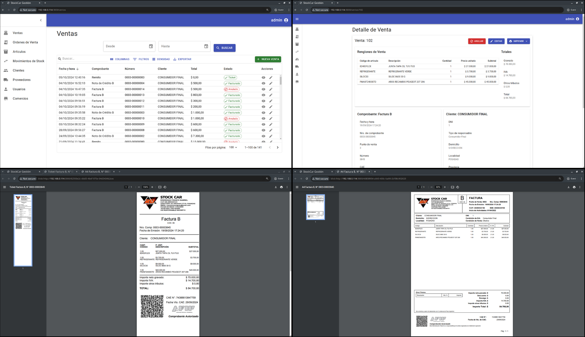
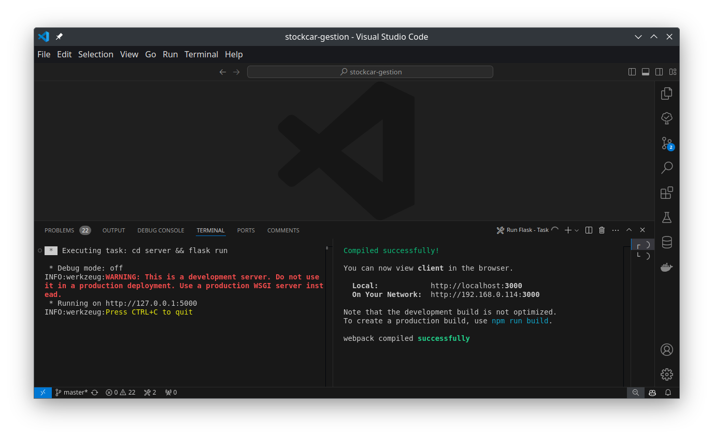

## Acerca del Proyecto

<p>

</p>

Sistema de facturación y gestión de inventario para Repuestos Stock Car, una empresa dedicada a la venta de repuestos automotores. Este sistema actualmente se encuentra en estado de producción dentro de la empresa y en constante actualización con nuevas funcionalidades.

### Desarrollado con

<p align="left">
<a href="https://flask.palletsprojects.com/en/3.0.x/" target="blank"></a>

<a href="https://es.react.dev/" target="blank"></a>

<a href="https://mui.com/material-ui/getting-started/" target="blank"></a>
</p>

## Iniciando

Este documento proporciona instrucciones detalladas para instalar y ejecutar el proyecto, que consta de un servidor Flask y un cliente React.

### Prerequisitos

- Python 3.11 o superior

- npm 10.5 o superior

### Instalación

1. **Clonar el repositorio**:

    ```sh
    git clone https://github.com/facurodrij/stockcar-gestion.git
    ```

Es necesario descargar las dependencias necesarias para el backend y el frontend.

### Descarga de Dependencias

#### Backend (Flask)

2. **Crear y activar un entorno virtual (Recomendado)**:

    ```sh
    python -m venv venv

    source venv/bin/activate  # En Windows usa `venv\Scripts\activate`
    ```

3. **Ejecutar en la terminal**:

    ```sh
    pip install -r server/requirements.txt
    ```
    
#### Frontend (React)

4. **Movernos dentro del directorio `client/` y ejecutar**:

    ```sh
    cd client/ # Para movernos dentro del directorio

    npm install
    ```

## Ejecución

Antes de iniciar el servidor Flask debemos inicializar la base de datos.

1. **Movernos dentro del directorio `server/`**:

    ```sh
    cd server/
    ```

2. **Inicializar la base de datos**:

    ```sh
    flask db init
    ```

3. **Crear y ejecutar las migraciones**:

    ```sh
    flask db migrate -m "Nombre-de-la-migración"

    flask db upgrade
    ```

4. **(Opcional) Poblar las tablas con datos preestablecidos**:

    ```sh
    flask load_fixtures
    ```

5. **Create superusuario y permisos**:

    ```sh
    flask create_superuser `username` `password` `email`
    ```
    ```sh
    flask create_permissions
    ```

6. **Iniciar el servidor**:

    ```sh
    flask run
    ```

Antes de iniciar el cliente React debemos configurar una variable de entorno.

7. **Crear variable de entorno con el puerto del servidor Flask**:
    Dentro de la carpeta `client` debemos crear un archivo con nombre `.env`. En ese archivo debemos escribir la siguiente línea:

    ```
    REACT_APP_API_URL=http://127.0.0.1:5000/
    ```
    En caso de cambiar la url y puerto del servidor Flask es necesario actualizar la variable `REACT_APP_API_URL`.

8. **Iniciar el cliente**:

    ```sh
    npm start
    ```

En este punto deberiamos ver las dos terminales ejecutandose de la siguiente manera:



## Configuración Adicional

- **Configurar el archivo `config.py`**: Asegúrate de que el archivo `config.py` contenga las configuraciones necesarias para tu entorno. Principalmente en la configuración del **CORS**, una de las rutas definidas debe coincidir con la url y puerto de ejecución de React.
- **Configurar el Servicio de AFIP**: La configuración del servicio de AFIP se encuentra en `server/core/services/afip_service.py`. Allí debemos actualizar las variables `CUIT`, `CERT` y `KEY`, de la siguiente forma:

    ```py
    """
    CUIT: Código único identifación tributaria
    CERT: Ruta hacia certificado X.509 emitido por AFIP
    KEY: Ruta hacia la clave privada asociada al certificado
    """
    CUIT = 20428129572
    CERT = "/workspaces/stockcar-gestion/server/instance/afipws_test.cert"
    KEY = "/workspaces/stockcar-gestion/server/instance/afipws_test.key"
    ```

## Resolución de Problemas

- **Error de instalación de dependencias**: Verifica que estás utilizando la versión correcta de Python y npm.

- **Problemas con la base de datos**: Asegúrate de que la configuración en `config.py` es correcta y que el servicio de base de datos está en funcionamiento.
